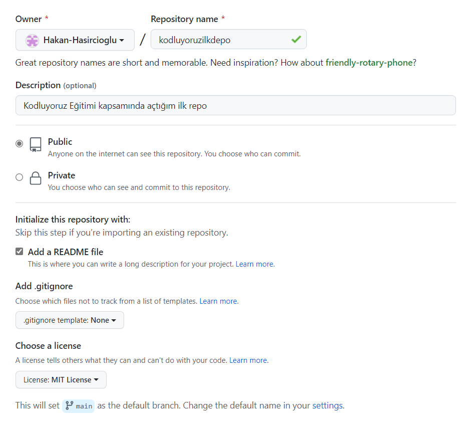

# kodluyoruzilkrepo

Bu repo [kodluyoruz](https://kodluyoruz.org/tr/kodluyoruz/) Front-End Eğitimi kapsamında açtığım ilk repo



## Installation

Öncelikle projeyi "clone"layın:
```
https://github.com/Hakan-Hasircioglu/kodluyoruzilrepo.git
```


Projeyi cloneladıktan sonra Visual Studio Code programında açınız.

Linux için:
```
cd kodluyoruzilkrepo
code .
```

## Contributing
Pull requestler kabul edilir. Büyük değişiklikler için, lütfen önce neyi değiştirmek istediğinizi tartışmak için bir konu açınız.

## License
[MIT](https://choosealicense.com/licenses/mit/)